# CMPSC472_project

## Table of Contents
- [Install](#install)
- [Introduction](#introduction)
- [Functions](#functions)
- [Results](#results)
- [Conclusion](#Conclusion)

## Install

### Clone the repository to your local machine using the following Git command:
```bash 
git clone <repository_url> 
```

### Install the required dependencies using the following command:
```bash 
pip install psutil 
```

### Run the Process Manager using the following command:
```bash 
python main.py
```

## Introduction
The goal of this project is to design and implement an advanced Process Manager with an emphasis on process synchronization. This Process Manager will allow users to create, manage, and synchronize processes in a multi-threaded environment. It will provide a command-line interface for process creation, management, and synchronization, and it will use system calls for process and thread control.

## Functions

### create_process(process_name)
-  This function creates a new child process using the multiprocessing module, which runs a function called process_function with the given process_name as an argument. It logs the creation of the child process.

### list_processes()
- This function uses the psutil library to list and log information about all running processes, including their process ID (PID), parent PID, name, and status. It provides a list of running processes to the user.

### process_function(process_name)
- This function is the entry point for a child process. It creates a separate log file for the child process and allows the user to create threads, list threads, or exit the child process.

### create_thread(thread_name, process_pid=None)
- This function creates a new thread within a process using the threading module. It logs the creation of the thread and maintains a list of threads associated with the process.

### list_threads()
- Lists and logs information about threads within a process, including their thread ID and name.

### terminate_thread(thread_name)
- Terminates a specified thread by setting a termination flag. It waits for the thread to complete and logs the termination.

### ipc_send_message(message)
- Sends an inter-process communication (IPC) message through a multiprocessing Pipe. It logs the sent message.

### ipc_receive_message()
- Reads and logs IPC messages from the log file, returning a list of received messages.

### producer(q)
- Demonstrates process synchronization by producing items and putting them into a multiprocessing Queue.

### consumer(q)
- Demonstrates process synchronization by consuming items from a Queue until receiving a termination signal.

### process_synchronization()
- Illustrates process synchronization by creating producer and consumer processes that interact through a shared Queue.

### main()
- The main program loop that provides a menu for the user to choose various options, such as creating processes, threads, managing threads, performing IPC, and demonstrating process synchronization. It logs the selected choices and provides a user-friendly interface for process and thread management.

## Results
### create process

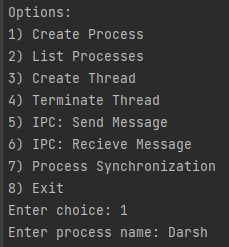
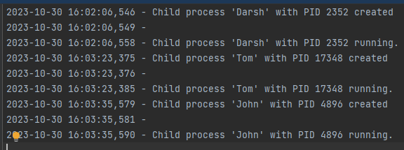

### List process

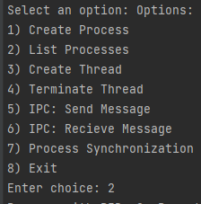
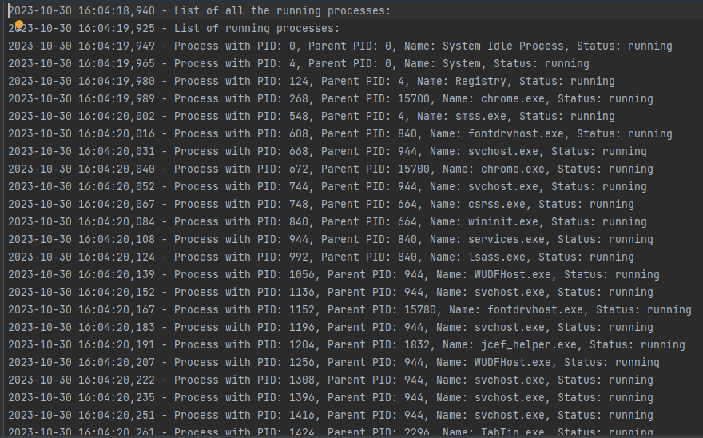
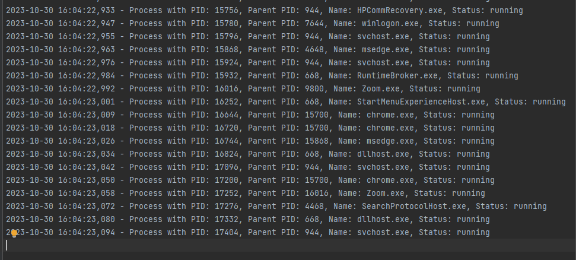

### Create Thread

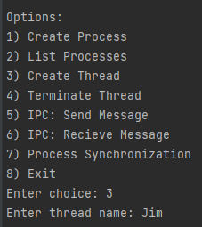
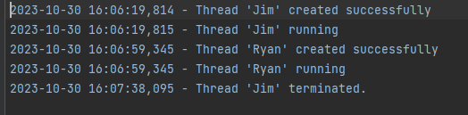

### Terminate Thread

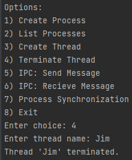


### ipc send message

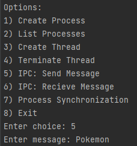

### ipc receive message

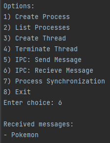

### process synchronization

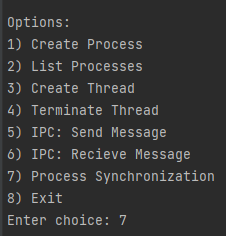
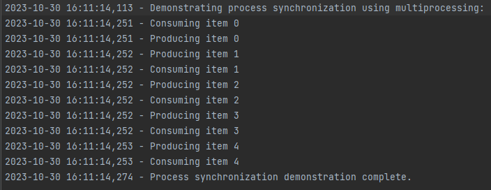


### Log file
- All the changes will be seen in the process_manager.log file

### Conclusion
- In summary, the Python program serves as a versatile process and thread management tool with inter-process communication and process synchronization capabilities. It enables users to create, list, and terminate processes and threads, facilitating flexible multitasking. Additionally, the program offers inter-process communication through a logging mechanism, allowing messages to be sent and received between processes. Process synchronization is demonstrated using a producer-consumer model, showcasing the power of multiprocessing in coordinating parallel tasks. Overall, the program provides a comprehensive command-line interface for managing and controlling concurrent tasks, making it a useful utility for users seeking to efficiently work with processes and threads while maintaining communication and synchronization between them.
